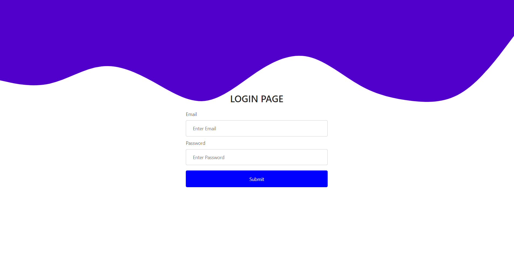
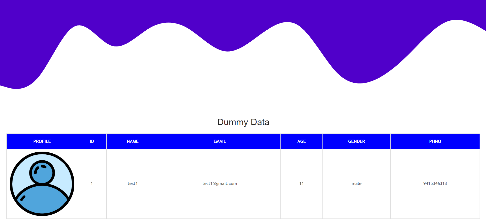

# React Login

[![Contributors][contributors-shield]][contributors-url]
[![Forks][forks-shield]][forks-url]
[![Stargazers][stars-shield]][stars-url]
[![Issues][issues-shield]][issues-url]

Its is a simple ReactJS project based one ReactJS framework that will that allow user to login and based on the credentials show user specific content (Currently only one user present). Content includes images, text message and also should have capability to load the messages as and when the scroll down the page.

## Basic Login Screen



## Dashboard after login



## Built With

### Developing tools

- Node.js
- React
- React-Dom
- CSS
- ES6
- Redux

### Styling and Lints

- Eslint
- Stylelint

### Deployment

- Heroku //(In progress)

## Getting Started

To get started with the app, please follow these steps:

- Navigate to the folder where you would like to save the game.

- Open your terminal by right-clicking, and opening the command line of your choice.

- Clone the repo by typing:

```
$ git clone https://github.com/shubham14p3/react-login.git
```

- Access the newly created folder by typing:

```
$ cd react-calculator
```

- Install the necessary dependencies:

```
npm install
```

- Bundle the resources and run the code locally:

```
$ npm run start
```

- Open [http://localhost:3000/](http://localhost:3080/) on your browser.

Note :

```
User id : shubham@gmail.com
Password : shubham123 
```

## Author

👤 **Shubham Raj**

- Github: [@ShubhamRaj](https://github.com/shubham14p3)
- Linkedin: [Shubham14p3](https://www.linkedin.com/in/shubham14p3/)

## Future Upgrades

- Conveting basic calculator to scientific calculator.

## 🤝 Contributing

Feel free to check the [issues page](https://github.com/shubham14p3/react-login/issues).

## Show your support

Give a ⭐️ if you like this project!

## Future Enhancment

o Copy & Paste, Drag & Fill (like in XL and Google sheets) Having only certain columns as editable
o Freezing columns
o Grouping row
o Nesting rows under other rows
o Displaying images/thumbnails
o Displaying errors and error messages
o Displaying text area, dropdowns, checkboxes, etc. in cells

## Acknowledgments

- Thanks to Pratyush Sir & Anupam Mam.

<!-- MARKDOWN LINKS & IMAGES -->

[contributors-shield]: https://img.shields.io/github/contributors/shubham14p3/react-login.svg?style=flat-square
[contributors-url]: https://github.com/shubham14p3/react-login/graphs/contributors
[forks-shield]: https://img.shields.io/github/forks/shubham14p3/react-login.svg?style=flat-square
[forks-url]: https://github.com/shubham14p3/react-login/network/members
[stars-shield]: https://img.shields.io/github/stars/shubham14p3/react-login.svg?style=flat-square
[stars-url]: https://github.com/shubham14p3/react-login/stargazers
[issues-shield]: https://img.shields.io/github/issues/shubham14p3/react-login.svg?style=flat-square
[issues-url]: https://github.com/shubham14p3/react-login/issues
